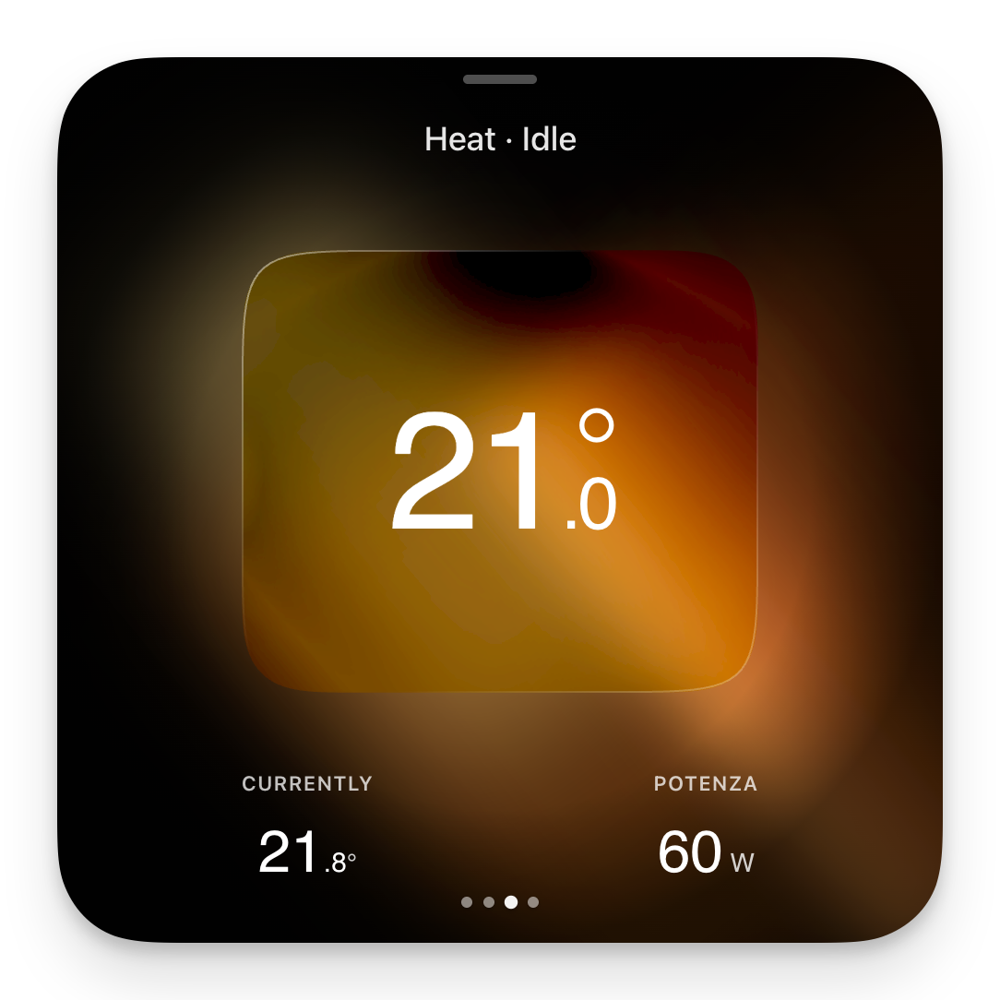
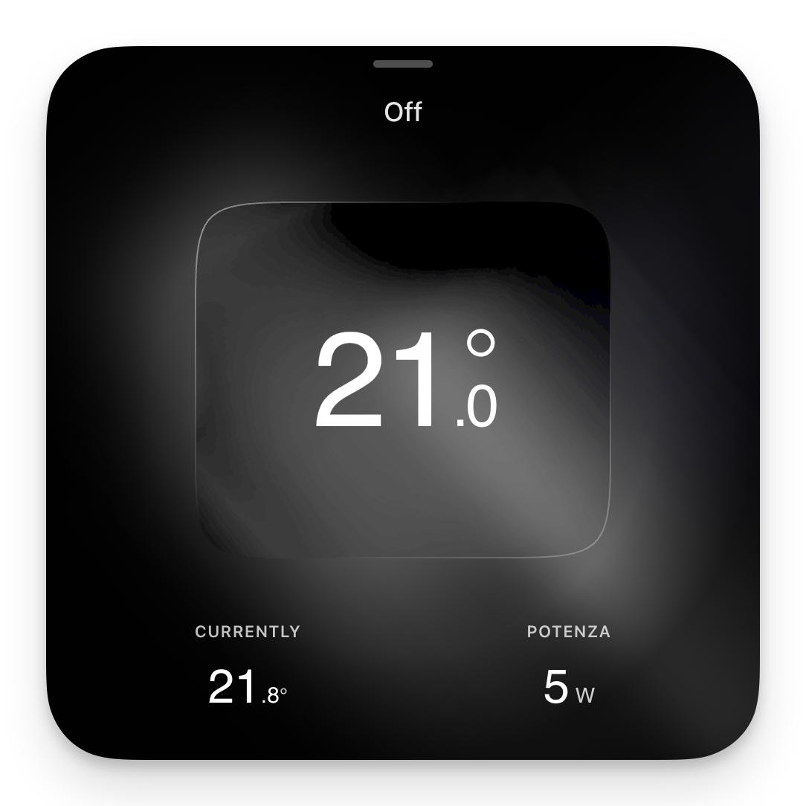
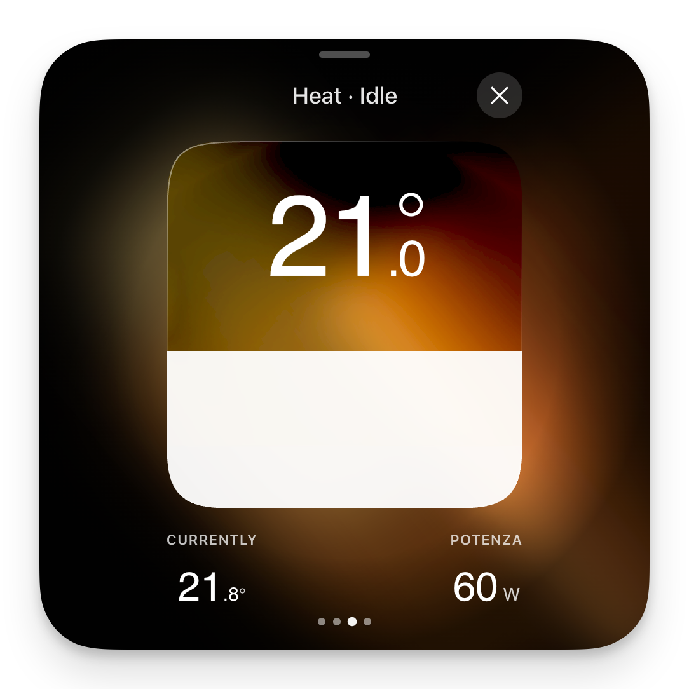

# Glass Thermostat Card

A beautiful liquid glass style thermostat card for Home Assistant with smooth animations and touch-friendly controls.

<p align="center">
  
  
  
</p>

## Features

- **Refractive Glass Effect**: Optional integration with the [Liquid Glass](https://github.com/FezVrasta/liquid-glass) HACS addon for enhanced refraction and squircle corners
- **Dynamic Background Colors**: Background gradients respond to HVAC state (Heating, Cooling, Idle, Off)
- **Touch-Friendly Controls**: Smooth vertical slider for temperature adjustment
- **Expandable Design**: Collapsible slider for a compact or detailed view
- **Secondary Entity Display**: Show power consumption, humidity, or any other sensor
- **Localized Status**: Automatically translates HVAC states and status text
- **High Performance**: Optimized animations and rendering logic

## Installation

### HACS (Recommended)

1. Open HACS in Home Assistant
2. Click the three dots menu and select "Custom repositories"
3. Add this repository URL and select "Lovelace" as the category
4. Search for "Glass Thermostat Card" and install
5. **Optional**: For the enhanced refraction effect, also install [Liquid Glass](https://github.com/FezVrasta/liquid-glass)
6. Restart Home Assistant

### Manual

1. Download `glass-thermostat-card.js` from the [latest release](../../releases/latest)
2. Copy to `config/www/glass-thermostat-card.js`
3. Add resource in Settings > Dashboards > Resources:
   ```
   /local/glass-thermostat-card.js
   ```

## Usage

### Visual Editor

The card includes a full visual editor for easy configuration.

### YAML Configuration

```yaml
type: custom:glass-thermostat-card
entity: climate.living_room
```

## Configuration Options

| Option | Type | Default | Description |
|--------|------|---------|-------------|
| `entity` | string | **required** | Climate entity ID |
| `secondary_entity` | string | `null` | Optional secondary sensor (power, humidity, etc.) |
| `secondary_label` | string | `null` | Custom label for secondary entity |

### Secondary Entity Example

Display power consumption or humidity alongside the thermostat:

```yaml
type: custom:glass-thermostat-card
entity: climate.heating
secondary_entity: sensor.heating_power
secondary_label: Power
```

## Dynamic Background Colors

The card automatically adjusts its background gradient based on HVAC state:
- **Heating active**: Red/orange gradient
- **Cooling active**: Blue gradient
- **Heat mode (idle)**: Warm orange gradient
- **Cool mode (idle)**: Light blue gradient
- **Off**: Gray gradient

## License

MIT License - see [LICENSE](LICENSE) for details.
